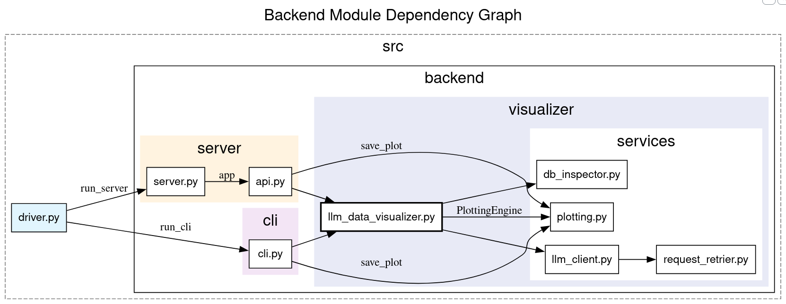

# Advanced Data Analysis Toolkit

## Overview

The Advanced Data Analysis Toolkit is a versatile tool designed for analyzing and visualizing relational databases. It enables users to connect to databases, inspect schemas, perform exploratory data analysis, and generate reusable reports. The toolkit leverages advanced Python techniques and modern development practices to ensure scalability, maintainability, and ease of use.

## Features

### Reports

Each report consists of two components:

#### Generic Section

- **Schema Diagram**: Visual representation of tables, primary keys, foreign keys, and relationships.
- **Data Quality Overview**: Summaries of missing values, null distributions, and column-level completeness.
- **Descriptive Statistics**: Ranges, percentiles, distributions, and outlier indicators for numerical fields.

#### Dynamic Section
- **Prompt-Driven Queries**: User-defined prompts are converted into SQL queries using a Retrieval-Augmented Generation (RAG) model.
- **Result Tables**: Outputs of the executed queries.
- **Visualizations**: Graphical representations of the results.

## Usage

### Using `just`

The `justfile` is used for task automation. Key tasks include:
- **Linting**:
  - `just lint`: Runs code style checks using `ruff`, `black`, `mypy`, `vulture`, and `pip-audit`.
  - `just lint-fix`: Automatically fixes code style issues.
  - `just lint-full`: Runs both `lint-fix` and `lint`.
- **Testing**:
  - `just test *args`: Runs tests with optional arguments.
  - `just coverage`: Generates a coverage report.
- **Serving the Application**:
  - `just serve`: Starts the server in production mode.
  - `just serve-dev`: Starts the server in development mode with auto-reload.
  - `just serve-presentation`: Starts the server with presentation settings (optimized for generative models).
- **Fetching Sample Data**:
  - `just fetch-chinook`: Downloads and sets up the Chinook sample database.

### Using Docker Compose

The toolkit can be deployed using Docker Compose. Application can be started in three modes:

```bash
docker compose up toolkit-server
docker compose up toolkit-dev
docker compose up toolkit-presentation
```

Which correspond to the `serve`, `serve-dev`, and `serve-presentation` just commands respectively.

All the commands will launch the server and make it accessible at the configured port.

### Running the CLI

The toolkit can also be run from the command line. Example usage:

```bash
python ./src/driver.py --help
```

#### Logging and Verbosity

The CLI supports standard logging and verbosity flags. Use `-v` to increase verbosity:

- No `-v`: warnings and errors only
- `-v`: info messages
- `-vv` or more: debug messages

## Architecture

### Module Dependency Graphs



For sake of clarity, the dependencies related to logging have been omitted from the graph.

## Advanced Python Techniques

This project employs several advanced Python techniques and tools:

- **Unit Testing**: Comprehensive test coverage using `pytest`.
- **Pytest Fixtures**: Reusable, isolated test setup using `@pytest.fixture`.
- **Mocking**: Controlled dependency isolation with `pytest` monkeypatching.
- **Dataclasses**: Structured, lightweight data containers using `DataClass`.
- **Type Hinting**: Explicit static typing with Python type annotations to improve readability and tooling support.
- **Exception Handling**: Explicit and robust error handling to ensure reliability.
- **Separation of Concerns**: Clear boundaries between API access, retry logic, and application logic.
- **Configuration via Environment Variables**: Runtime configuration using environment variables and `.env` files.
- **Logging**: Structured logging for debugging and operational visibility.
- **Python Environment Management**: Dependency and virtual environment management using `uv`.
- **Containerization**: Application containerization using Docker and Docker Compose for reproducible environments.
- **CI Pipeline**: Automated linting checks executed as part of a continuous integration pipeline.


## Development Environment

The development environment for the Advanced Data Analysis Toolkit is designed to ensure consistency, ease of use, and scalability. Below are the key components and tools used in the development process:

#### Package Management with `uv`

The project uses `uv` for package management, which provides:
- **Isolated Environments**: Each project has its own virtual environment to avoid dependency conflicts.
- **Dependency Caching**: Speeds up installation by caching dependencies.
- **Reproducible Builds**: Ensures that the same dependencies are installed across different environments.

#### Dev Containers

The project includes a `.devcontainer` configuration, which provides:
- **Pre-installed Dependencies**: Ensures all required libraries and tools are available.
- **Docker-based Isolation**: Guarantees a consistent environment across different machines.
- **Simplified Onboarding**: New contributors can quickly set up their environment.

#### Justfile

The `justfile` is used for task automation, allowing developers to run common tasks such as linting, testing, and serving the application with simple commands. This streamlines the development workflow and reduces the potential for errors. The available commands were detailed in the "Usage" section above.

#### Dockerfile

The `Dockerfile` defines a multi-stage build process:
- **Builder Stage**:
  - Uses the `uv` image for dependency management and bytecode compilation.
  - Installs necessary system dependencies like `libcairo2` and `graphviz`.
  - Caches dependencies for faster builds.
- **Runtime Stage**:
  - Uses a slim Python image for a lightweight runtime environment.
  - Copies the application and dependencies from the builder stage.
  - Exposes port `8000` for the application.

#### Linting and Formatting

- **`ruff`**: Ensures code adheres to style guidelines.
- **`black`**: Automatically formats code for consistency.
- **`mypy`**: Performs static type checking.
- **`vulture`**: Identifies unused code.
- **`pip-audit`**: Checks for vulnerabilities in dependencies.

#### Version Control

- **Git Hooks**: Pre-commit hooks are used for linting and testing.
- **Pull Requests**: All changes are introduced via pull requests, requiring approval from at least one other team member.
- **Copilot Auto-Reviews**: GitHub Copilot is configured to provide automated code reviews, assisting in maintaining code quality and consistency.
